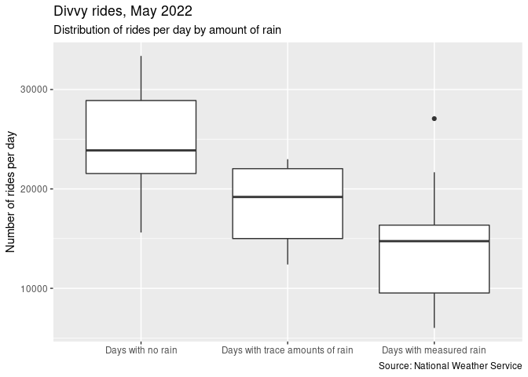
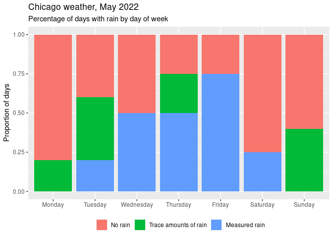
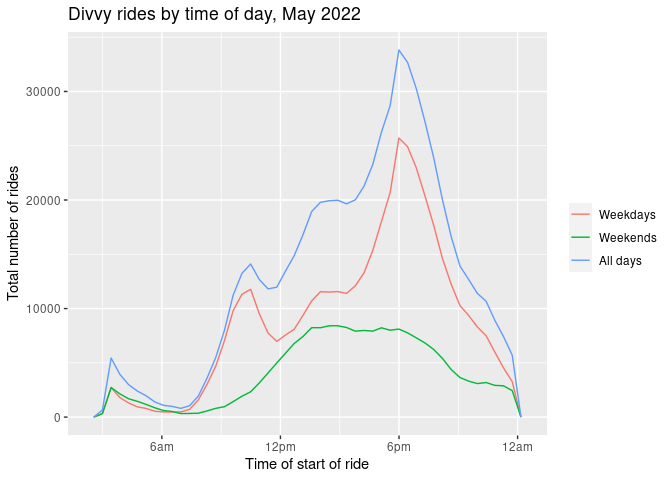
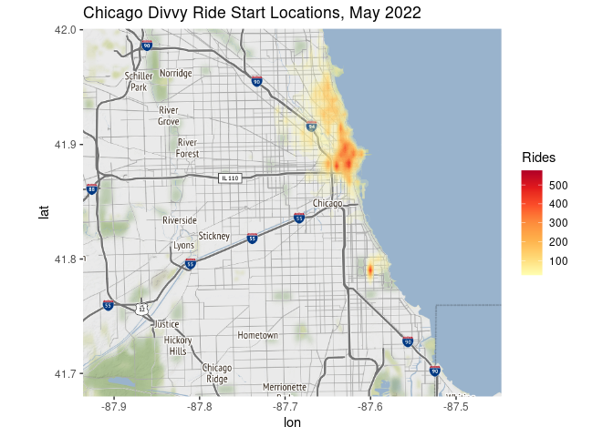
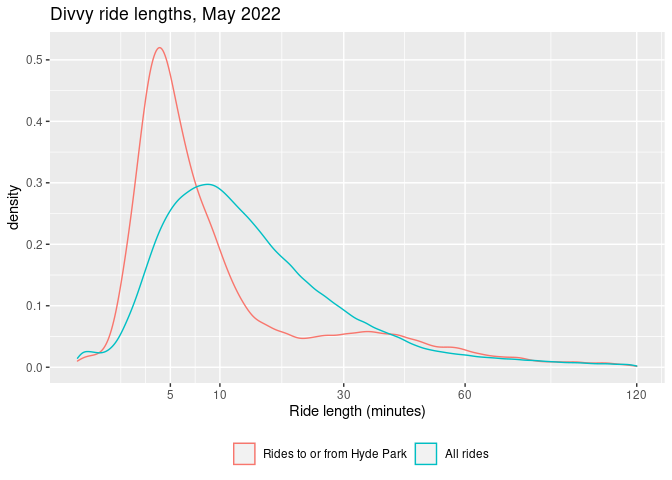
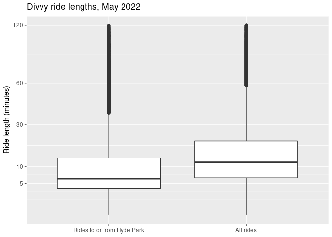

Exploring Divvy Ride Data
================
Ben Brown

For this assignment, I asked the following question: how, when, and
where are Divvy bikes used in the city of Chicago, and who uses them?
How does that use differ by day, time of day, and neighborhood? The data
I analyzed for this project was publicly available Divvy trip data,
which can be found
[here.](https://divvy-tripdata.s3.amazonaws.com/index.html)
Specifically, I chose to analyze ride data from May of 2022, which is
the most recent month available. I would have analyzed data for more
months, but I was limited in part by file size since there were 634858
many rides in May of this year alone.

To begin my research, I identified a number of factors that could
indicate what Chicagoans use Divvy bikes for. These include:

-   Day of the week: weekend rides are more likely to be
    leisure-oriented, whereas weekday rides are more likely to be
    commutes.
-   Time of day: Rides during rush-hour are more likely to be commutes,
    whereas leisure rides would be spread more evenly throughout the
    day.
-   Trip time: people using bikes to ride between neighborhoods will
    have longer times than people using them to get around their
    neighborhood. Trip time is also a better indicator of ride length
    than distance between start and end locations because some rides may
    be circular.
-   Start/end location: different neighborhoods may use divvy bikes more
    or less due to differences in population, socioeconomic status, and
    other factors.

## Day of the Week

First, I analyzed the average number of rides for each day of the week.

<!-- -->

This bar graph shows that Saturday had the highest average number of
rides, followed by Monday, Thursday, and Sunday. Wednesday had the
fewest rides, at around 70% of Saturday’s. The fact that Saturday is the
highest does suggest that Divvy rides are used more so for leisure than
for commuting, but the high number of rides on Monday and Thursday
suggest that both leisure and commuting make up a significant number of
rides.

However, since the size of this data set is small (31 days), other
factors, in particular weather, could be a larger influence than ride
type. For instance, Saturdays and Mondays could have had less rain on
average than Wednesdays and Fridays. To test this, I compared this data
with weather data from the National Weather Service to see if days with
rain had fewer rides than days without.

<!-- -->

This boxplot shows that days with measured rain tended to have fewer
rides than days with no rain, and that days with trace amounts of rain
fell in between. This is not surprising, since people usually do not
want to ride a bike on a rainy day.

<!-- -->

This chart shows us that Saturdays and Mondays had the highest
proportion of days with no rain, followed by Sundays. Fridays were the
rainiest, followed by Thursdays. It seems from this graph that the days
of the week with more rides also had better weather, so the differences
in the previous graph likely happened because of differences in weather
and not from people using Divvy bikes more for weekend leisure rides
than weekday commutes.

## Time of Day

Next, I analyzed the times of day that were most common for weekday and
weekend rides.

<!-- --><!-- -->

The graphs for weekdays and weekends look suprisingly different. For
weekdays, a large number of rides begin in the evening and many more
rides take place in the morning than in the middle of the day. These
peaks correspond with rush hour times. For weekends, rides increase
slowly into the early afternoon and stay at a similar level until the
evening. The shapes of these graphs suggest that on weekdays, Divvy
bikes are mostly used for commuting to and from work, whereas on
weekends they are mostly used for leisure. However, the weekday graph
continues to rise into the early afternoon like the weekend graph,
suggesting that many people use Divvy bikes for leisure on weekdays as
well. Combining this result from the previous graph, we see that even
though similar numbers of rides occur per day on weekdays and weekends,
what kinds of rides they are differ significantly.

## Geographic Location

Finally, I analyzed the data spatially, plotting where in the city the
most rides begin and end.

<!-- --><!-- -->

From these maps, we can see that the most common starting and ending
locations are downtown, on the north and north-west sides, and in Hyde
Park. Downtown is the most populated area of the city, so one would
expect it to have the highest number of rides. Each of these hotspots
are in areas of higher socioeconomic status, which suggests a positive
correlation between socioeconomic status and Divvy ridership.

The Hyde Park hotspot lies notably between Cottage Grove and Woodlawn,
around the University of Chicago, which suggests that UChicago students,
faculty and staff use Divvy bikes a lot. I hypothesized that the average
trip time for rides two or from Hyde Park would be shorter than for all
rides because of students using Divvy bikes to get around the
university.

<!-- --><!-- -->

These graphs shows that rides to or from Hyde Park are typically shorter
than all rides. In fact, the boxplot shows that nearly half of the rides
to or from Hyde Park are under 5 minutes long, as opposed to less than a
quarter of all rides. This suggests that a greater than average
proportion of riders in Hyde Park use Divvy rides to get around their
neighborhood or to get to and from adjacent neighborhoods. This is
likely because of UChicago students, faculty, and staff, [who receive a
discounted membership
rate,](https://safety-security.uchicago.edu/services/biking/) using
Divvy bikes to get around campus. To test this hypothesis, one could run
the same analysis for a month in the summer where class is not in
session and compare the results.

In addition, the density graph shows a second, smaller peak of rides to
or from Hyde Park lasting from around 30 to 50 minutes. This is around
the time it takes to bike from Hyde Park to downtown, the biggest
hotspot for ride starts and ends, so these rides are likely between Hyde
Park and downtown. It’s possible that other neighborhoods have peaks
like this one at the approximate time it takes to bike between there and
downtown because it is such a popular destination.

## Conclusion

In conclusion, I discovered that there Chicagoans use Divvy bikes for a
number of significant reasons, but those reasons can differ
significantly depending on the day of the week and the neighborhood.
Weather also has a large effect on how many rides occur on a given day,
and can potentially confound the relationship between other variables.
For future research, one could analyze rides to and from other
neighborhoods besides Hyde Park, or use data from multiple months or
years to analyze how Divvy ridership has changed over time.
