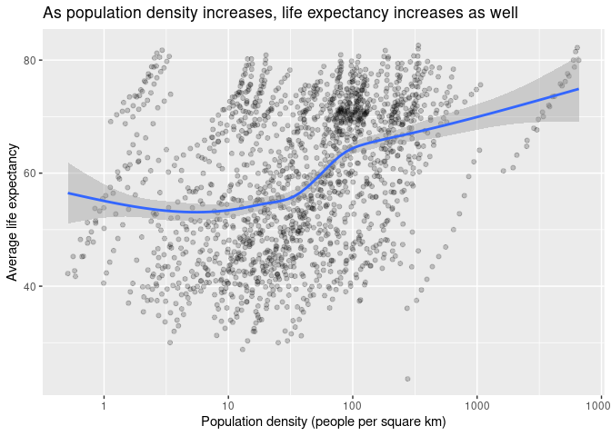
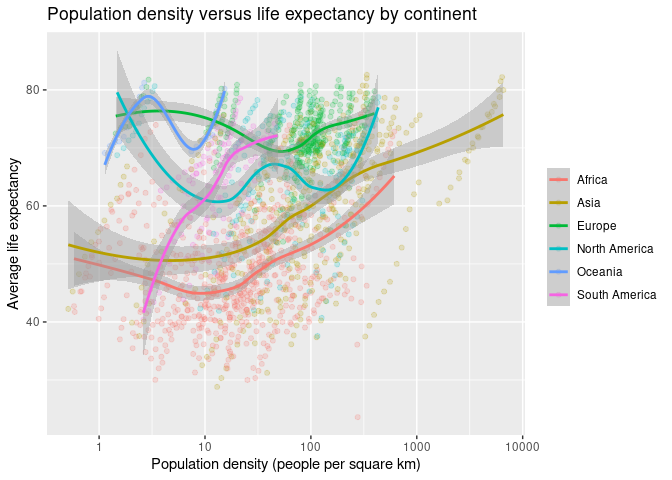

Part 1: Exploring Gapminder Data
================
Ben Brown

### 1. Get the country information using geonames - remember there is a R package for this (see the lecture notes)

``` r
# Note that I edited my .Rprofile file to set geonamesUsername

countryInfo <- tibble(GNcountryInfo())
```

### 2. Merge gapminder and the country information from geonames

-   Use left_join from dplyr to merge the tables
-   Note that you cannot directly do this - gapminder writes the name of
    countries differently from geonames. To complete the merge, you need
    a unique key to match observations between the data frames
-   There is neat little package for R called countrycode that helps
    solve this problem. countrycode() takes as an input a country’s name
    in a specific format and outputs it using whatever format you
    specify.
    -   `gapminder` stores them using the country.name format
    -   `geonames` stores them under the countryCode column using the
        iso2c format
    -   I leave it to you to make the joining operation work

``` r
# change gapminder's country names to corresponding iso2c codes,
# Then merge with countryInfo
countryData <- gapminder %>%
  mutate(country = countrycode(sourcevar = country,
                               origin = "country.name",
                               destination = "iso2c")) %>%
  left_join(countryInfo, by = c("country" = "countryCode")) %>%
  mutate(areaInSqKm = as.numeric(areaInSqKm)) # Convert area to numeric

countryData
```

    ## # A tibble: 1,704 × 23
    ##    country continent.x  year lifeExp      pop gdpPercap continent.y capital
    ##    <chr>   <fct>       <int>   <dbl>    <int>     <dbl> <chr>       <chr>  
    ##  1 AF      Asia         1952    28.8  8425333      779. AS          Kabul  
    ##  2 AF      Asia         1957    30.3  9240934      821. AS          Kabul  
    ##  3 AF      Asia         1962    32.0 10267083      853. AS          Kabul  
    ##  4 AF      Asia         1967    34.0 11537966      836. AS          Kabul  
    ##  5 AF      Asia         1972    36.1 13079460      740. AS          Kabul  
    ##  6 AF      Asia         1977    38.4 14880372      786. AS          Kabul  
    ##  7 AF      Asia         1982    39.9 12881816      978. AS          Kabul  
    ##  8 AF      Asia         1987    40.8 13867957      852. AS          Kabul  
    ##  9 AF      Asia         1992    41.7 16317921      649. AS          Kabul  
    ## 10 AF      Asia         1997    41.8 22227415      635. AS          Kabul  
    ## # … with 1,694 more rows, and 15 more variables: languages <chr>,
    ## #   geonameId <chr>, south <chr>, isoAlpha3 <chr>, north <chr>, fipsCode <chr>,
    ## #   population <chr>, east <chr>, isoNumeric <chr>, areaInSqKm <dbl>,
    ## #   west <chr>, countryName <chr>, postalCodeFormat <chr>, continentName <chr>,
    ## #   currencyCode <chr>

### 3. Calculate the population density for each observation

``` r
pop_density <- countryData %>%
  mutate(popDensity = pop / areaInSqKm) # Use gapminder's population statistic

pop_density
```

    ## # A tibble: 1,704 × 24
    ##    country continent.x  year lifeExp      pop gdpPercap continent.y capital
    ##    <chr>   <fct>       <int>   <dbl>    <int>     <dbl> <chr>       <chr>  
    ##  1 AF      Asia         1952    28.8  8425333      779. AS          Kabul  
    ##  2 AF      Asia         1957    30.3  9240934      821. AS          Kabul  
    ##  3 AF      Asia         1962    32.0 10267083      853. AS          Kabul  
    ##  4 AF      Asia         1967    34.0 11537966      836. AS          Kabul  
    ##  5 AF      Asia         1972    36.1 13079460      740. AS          Kabul  
    ##  6 AF      Asia         1977    38.4 14880372      786. AS          Kabul  
    ##  7 AF      Asia         1982    39.9 12881816      978. AS          Kabul  
    ##  8 AF      Asia         1987    40.8 13867957      852. AS          Kabul  
    ##  9 AF      Asia         1992    41.7 16317921      649. AS          Kabul  
    ## 10 AF      Asia         1997    41.8 22227415      635. AS          Kabul  
    ## # … with 1,694 more rows, and 16 more variables: languages <chr>,
    ## #   geonameId <chr>, south <chr>, isoAlpha3 <chr>, north <chr>, fipsCode <chr>,
    ## #   population <chr>, east <chr>, isoNumeric <chr>, areaInSqKm <dbl>,
    ## #   west <chr>, countryName <chr>, postalCodeFormat <chr>, continentName <chr>,
    ## #   currencyCode <chr>, popDensity <dbl>

### 4. Produce an updated graph using population density

-   If you want to be real fancy, estimate a statistical model or
    compare the relationship across continents

``` r
ggplot(
  data = pop_density,
  mapping = aes(x = popDensity, y = lifeExp)
) + 
  geom_point(alpha = 0.2) +
  geom_smooth() +
  scale_x_log10() +
  labs(
    title = "As population density increases, life expectancy increases as well",
    x = "Population density (people per square km)",
    y = "Average life expectancy"
  )
```

<!-- -->

The new graph shows that as population density increases, life
expectancy does as well. What’s interesting about both graphs is that
there are clear lines of dots that have an upward trend. These lines
correspond to one country over time, and they show that over time,
countries’ population, population density, and average life span have
generally increased. It would thus be interesting to compare the
relation between different countries at the same time or the same
country across different time, to see if the year or the country matters
more.

``` r
ggplot(
  data = pop_density,
  mapping = aes(x = popDensity, y = lifeExp, color = continentName)
) + 
  geom_point(alpha = 0.2) +
  geom_smooth() +
  scale_x_log10() +
  # Use gapminder's colors for the different continents
  scale_color_discrete(name = NULL) +
  labs(
    title = "Population density versus life expectancy by continent",
    x = "Population density (people per square km)",
    y = "Average life expectancy"
  )
```

<!-- -->

The continent where the correlation is most positive is South America.
Asia and Africa also have a generally positive correlation, with a
somewhat negative one at lower population densities. Europe and North
America have less correlation than the other groups. Finally, Oceania’s
graph looks like there is some kind of sinusoidal correlation at first,
but it is actually made up of two groups of points, each with a positive
correlation, so there is likely positive correlation here as well.

It seems that less developed continents have a more positive
relationship between population density and life expectancy. This is
likely because over the past few decades, these areas had the highest
population growth and the most health improvements, leading to older
data points generally having both lower density and life expectancy,
while newer data points had higher density and life expectancy.
