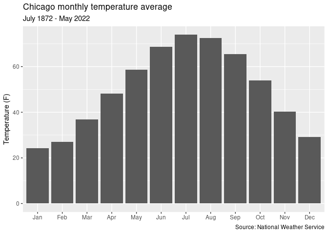
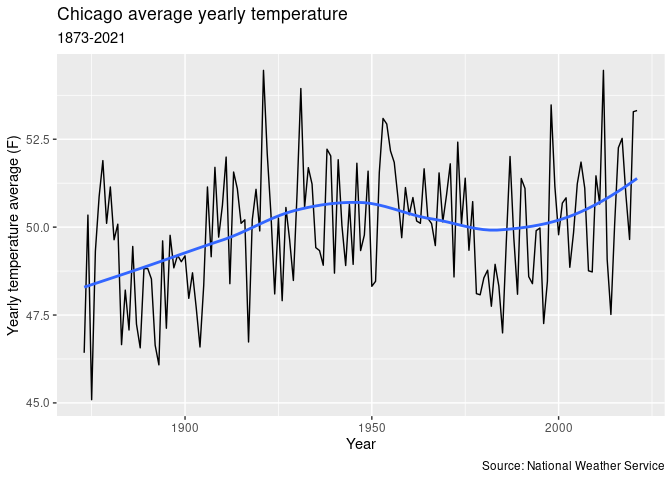
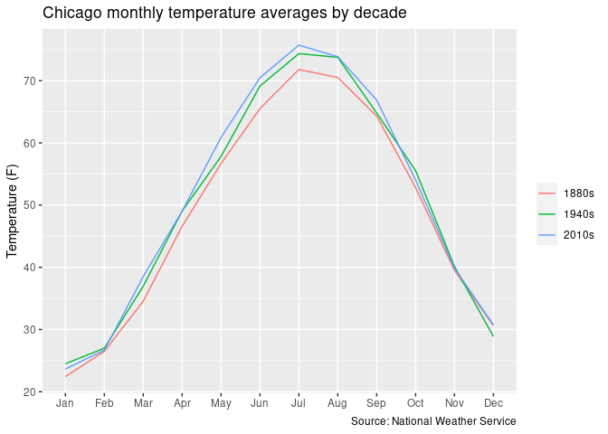
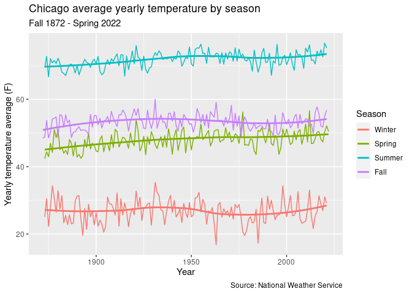

Part 2
================
Ben Brown

For my Homework \#6, part of the data I used was a table that I copied,
pasted, and reformatted into a .csv file. For this homework, I wondered
if I could do the same thing but reproducibly with web scraping.
Unfortunately, I was unable to scrape that data due to how it was
displayed on the website, so I chose a different series of tables from
the same website. These tables each show the mean temperature of a given
month in Chicago for the past \~150 years.

``` r
# scrape_month: scrapes an NWS page for a given month's temperature averages 
# from 1872-2022 for Chicago.
# Input: The number of a month, between 1 and 12
# Output: a dataframe with that month's mean temperature for each year
scrape_month <- function(month_num) {
  
  # Create the URL
  url <- sprintf("https://www.weather.gov/lot/%s_Temperature_Rankings_Chicago",
                 month.name[month_num])
  #Read the HTML page with the URL
  page <- read_html(url)

  # The CSS needed to extract the 1st column differs based on the page
  if(month_num == 3) {
    # Need 7 td's for column 1
    temp_css <- "td td td td td td td:nth-child(1), td td td:nth-child(4) , td td:nth-child(7)"
  } else if (month_num %in% 5:8) {
    # Need 6 td's
    temp_css <- "td td td td td td:nth-child(1), td td td:nth-child(4) , td td:nth-child(7)"
  } else {
    # Need 5 td's
    temp_css <- "td td td td td:nth-child(1), td td td:nth-child(4) , td td:nth-child(7)"
  }
                  
  meanTemp <- html_elements(x = page, css = temp_css) %>%
    html_text2()
  # Filter out blank entries
  meanTemp <- meanTemp[meanTemp != " "]

  year <- html_elements(x = page, css = "td td:nth-child(2), td td:nth-child(5), td td:nth-child(8)") %>%
    html_text2()
  year <- year[year != " "]

  # Make the data frame
  weatherData <- tibble(meanTemp, year) %>%
    # Add month column and convert year to integer
    mutate(month = factor(month_num, levels = 1:12, labels = month.abb), 
           year = as.integer(year), 
           meanTemp = as.numeric(meanTemp)) %>%
    # Arrange oldest to newest
    arrange(year)

  return(weatherData)
}

# Loop that combines the dataframes generated by scrape_month() for each month

tempMeans <- tibble()

for(i in 1:12) {
  tempMeans <- bind_rows(tempMeans, scrape_month(i))
}

tempMeans
```

    ## # A tibble: 1,799 × 3
    ##    meanTemp  year month
    ##       <dbl> <int> <fct>
    ##  1     19.6  1873 Jan  
    ##  2     28.1  1874 Jan  
    ##  3     16.2  1875 Jan  
    ##  4     32.8  1876 Jan  
    ##  5     22.3  1877 Jan  
    ##  6     31.8  1878 Jan  
    ##  7     21.3  1879 Jan  
    ##  8     39.8  1880 Jan  
    ##  9     19.4  1881 Jan  
    ## 10     28.6  1882 Jan  
    ## # … with 1,789 more rows

First, I wanted to analyze this data by plotting the average temperature
in Chicago for each month. Since June is the month where Chicago is most
exposed to the sun, and December is the month where it’s least exposed
to the sun, I expected June to have the warmest temperature on average
and December to have the coldest on average.

``` r
tempMeans %>%
  group_by(month) %>%
  summarize(mean = mean(meanTemp)) %>%
  ggplot(mapping = aes(x = month, y = mean)) +
  geom_col() +
  labs(
    title = "Chicago monthly temperature average",
    subtitle = "July 1872 - May 2022",
    x = NULL,
    y = "Temperature (F)",
    caption = "Source: National Weather Service"
  )
```

<!-- -->

July is the hottest month, with a mean temperature of over 70 degrees,
and January is the coldest month, with a mean temperature of around 25
degrees. Strangely, June is colder than the two months that follow it,
and December is warmer than the two months that follow it.

Next, I wanted to see how the annual mean temperature has changed over
time. I calculated the annual mean as the mean of all the monthly
temperatures, which isn’t entirely accurate since some months are longer
than others, but should be a very good estimate. The NWS also has the
annual means available, and they are the same as the ones calculate here
rounded to a tenth of a degree.

``` r
tempMeans %>%
  # Filter out years which lack data for every month
  filter(year != 1872 & year != 2022) %>%
  group_by(year) %>%
  summarize(yearlyMean = mean(meanTemp)) %>%
  ggplot(mapping = aes(x = year, y = yearlyMean)) +
  geom_line() +
  geom_smooth(se = FALSE) +
  labs(
    title = "Chicago average yearly temperature",
    subtitle = "1873-2021",
    x = "Year",
    y = "Yearly temperature average (F)",
    caption = "Source: National Weather Service"
  )
```

<!-- -->

Overall, the average yearly temperature increased from 1873 to 2021,
which is not surprising. Strangely, there seems to be a dip in
temperature during the 1980s, however this could just be caused by
random temperature fluctuations and not climate change.

Next, I wanted to see if there are certain months which have in
particular been made warmer by climate change than others. I
hypothesized that climate change would affect all months equally.

``` r
# Similar to first graph, but plots monthly averages for 3 different decades,
# separated by decade
tempMeans %>%
  # Create decade column from year
  mutate(decade = factor(year %/% 10)) %>%
  # Filter for only the 1880s, 1950s, and 2010s
  filter(decade %in% c(188, 194, 201)) %>%
  group_by(month, decade) %>%
  summarize(mean = mean(meanTemp)) %>%
  ggplot(
    mapping = aes(x = month, 
                  y = mean, 
                  color = factor(decade, levels = c(188, 194, 201),
                                 labels = c("1880s", "1940s", "2010s")),
                  group = decade)
    ) +
  geom_line() +
  scale_color_discrete(name = NULL) +
  labs(
    title = "Chicago monthly temperature averages by decade",
    x = NULL,
    y = "Temperature (F)",
    caption = "Source: National Weather Service"
  )
```

<!-- -->

``` r
# Like the 2nd graph, but separated by season
tempMeans %>%
  # Add season column 
  mutate(Season = fct_collapse(
    month,
    "Spring" = month.abb[3:5],
    "Summer" = month.abb[6:8],
    "Fall" = month.abb[9:11],
    "Winter" = month.abb[c(12,1,2)]
  )) %>%
  # Filter out seasons which lack data for every month,
  # i.e. summer and winter 1872 and winter 2022
  filter(!(year == 1872 & Season != "Fall"),
         !(year == 2022 & Season == "Winter")) %>%
  # Find the mean for each year and season.
  # Note winter 1900 contains December 1900, not December 1899
  group_by(Season, year) %>%
  summarize(mean = mean(meanTemp)) %>%
  ggplot(mapping = aes(x = year, y = mean, color = Season)) +
  geom_line() +
  geom_smooth(se = FALSE) +
  labs(
    title = "Chicago average yearly temperature by season",
    subtitle = "Fall 1872 - Spring 2022",
    x = "Year",
    y = "Yearly temperature average (F)",
    caption = "Source: National Weather Service"
  )
```

<!-- -->

From the first graph, it appears that the months with the greatest
temperature difference are the hotter months like June and July, and the
months where the average temperature has increased the least are colder
months like November and February. The second graph also shows this:
summer’s trendline seems to be the most positive of the four seasons,
and winter’s trendline seems the least positive. In addition, the second
graph shows that the dip in temperatures in the late 20th Century seems
to have been caused primarily by colder winters, since winter’s
trendline has the largest dip during that time. From these graphs, it
appears that climate change increases a month’s average temperature
proportionally to that month’s normal temperature.
